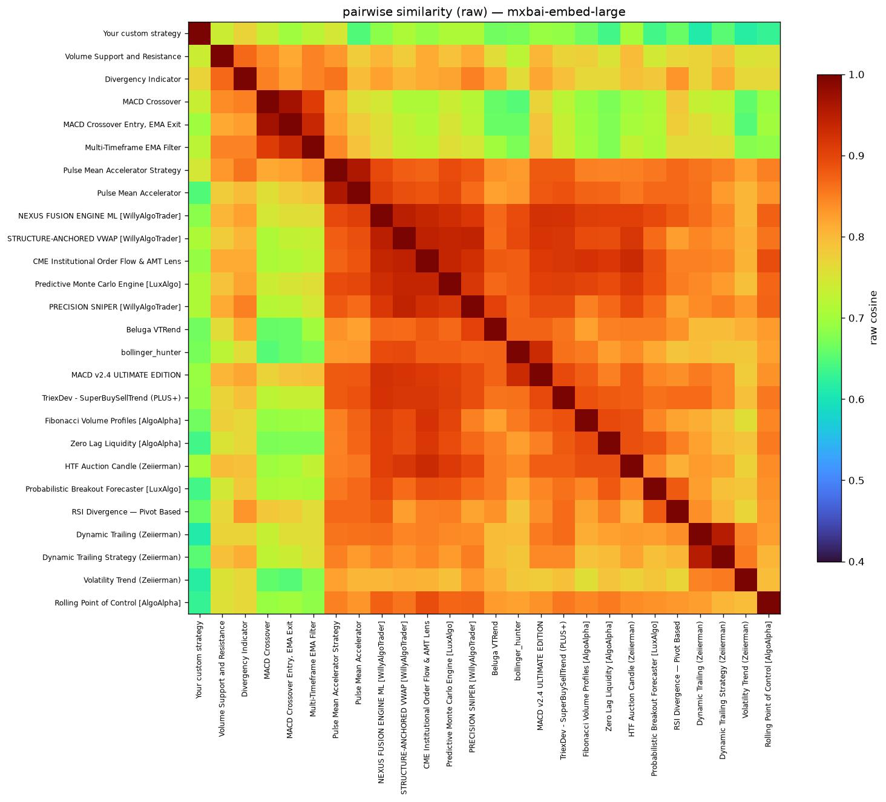
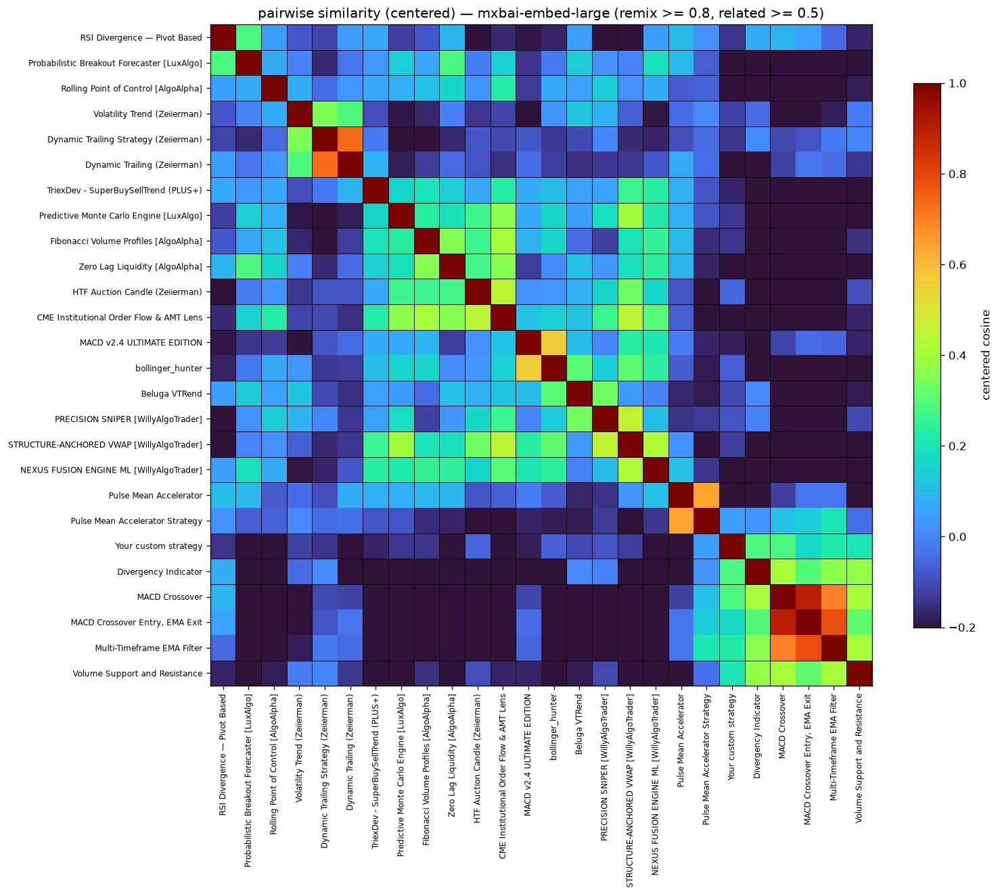
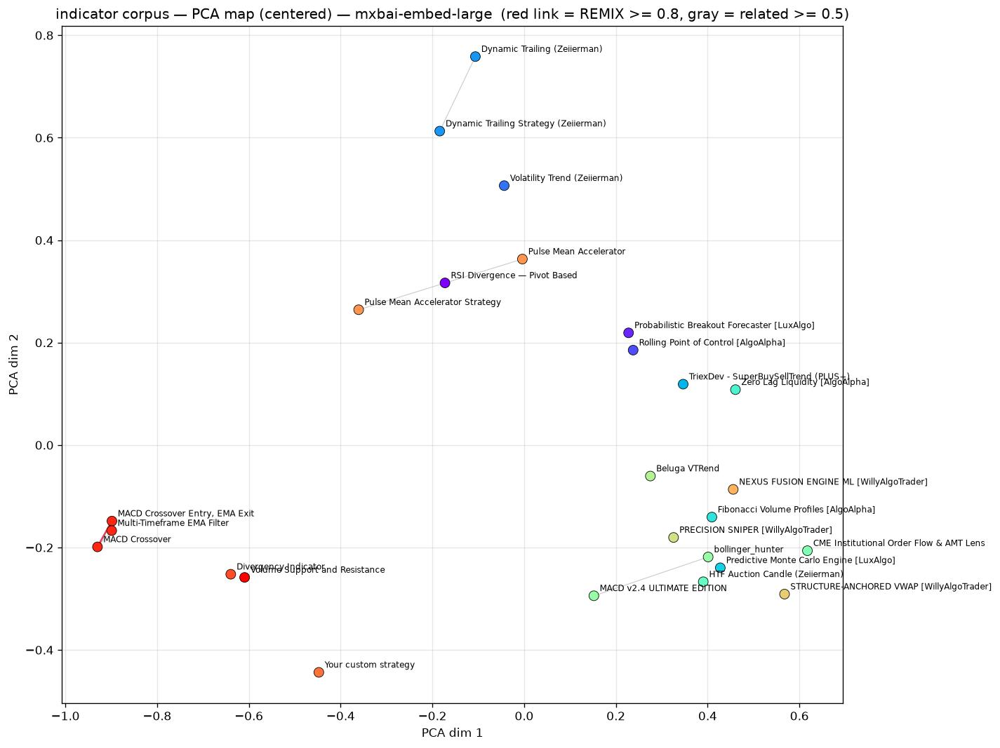
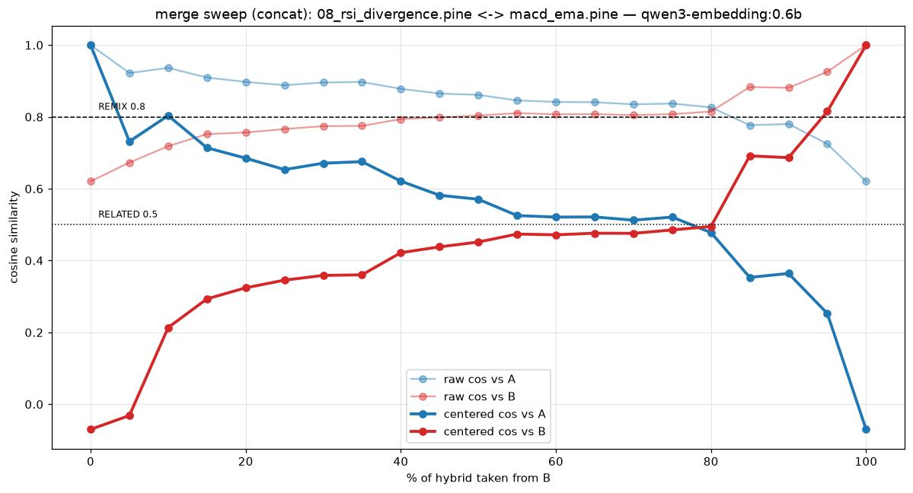
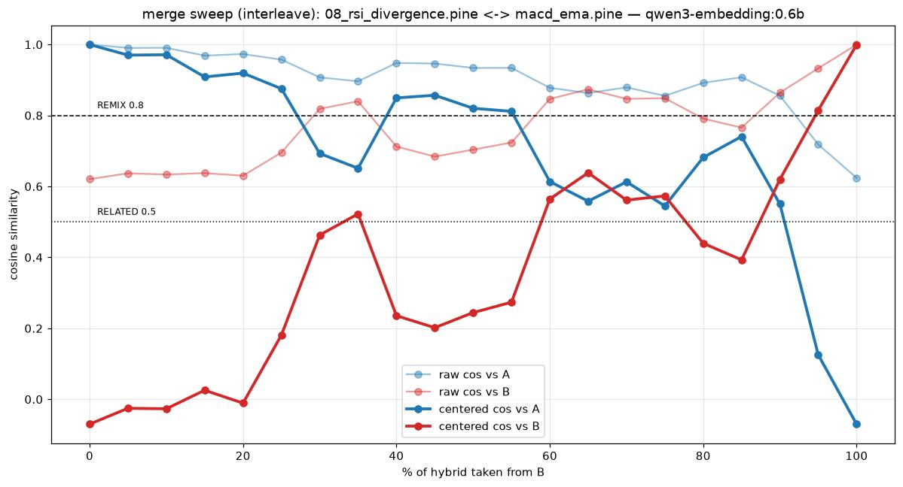
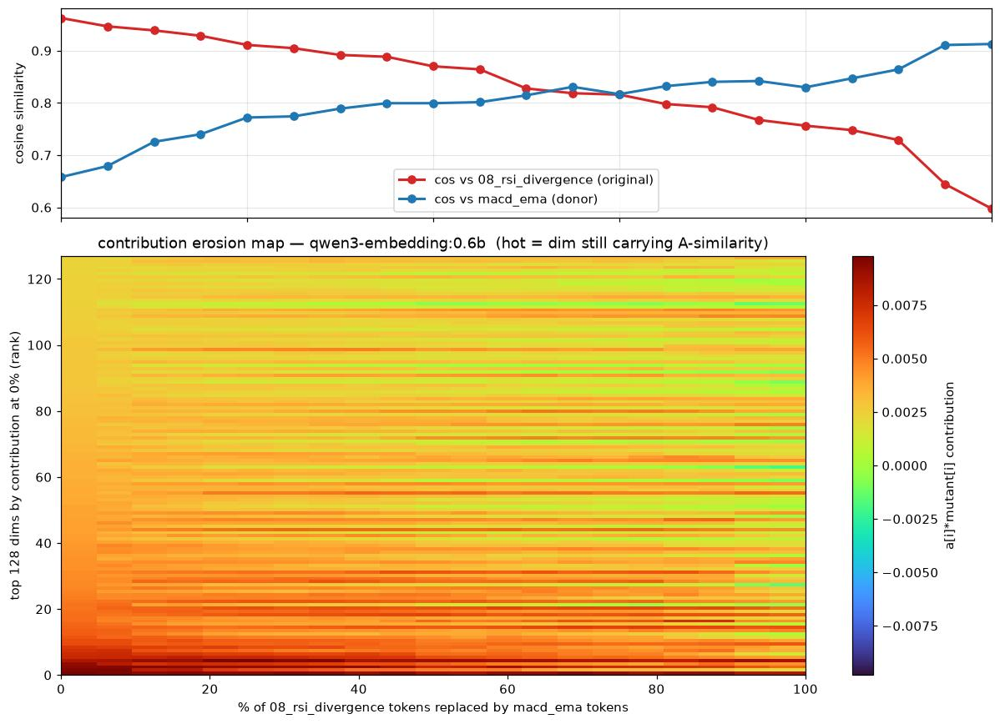
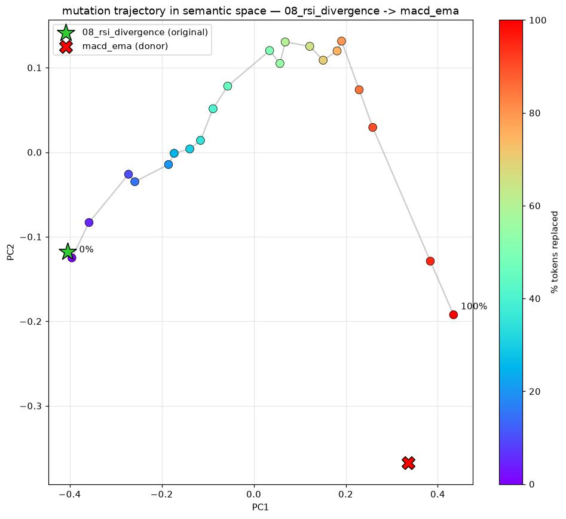
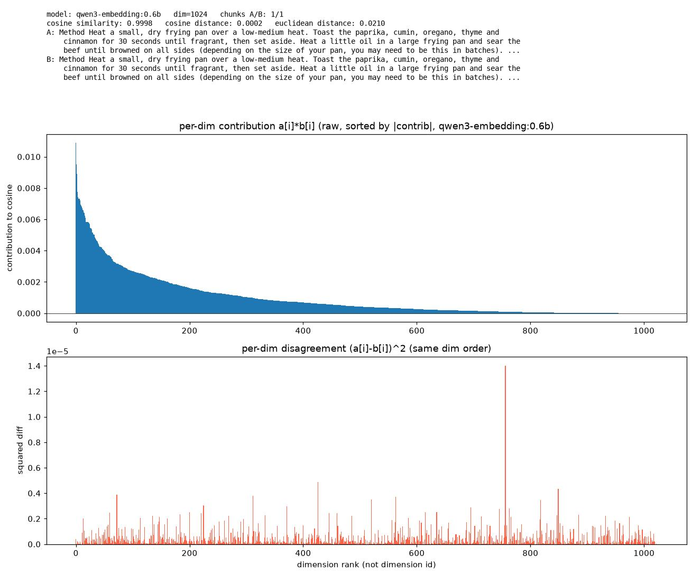
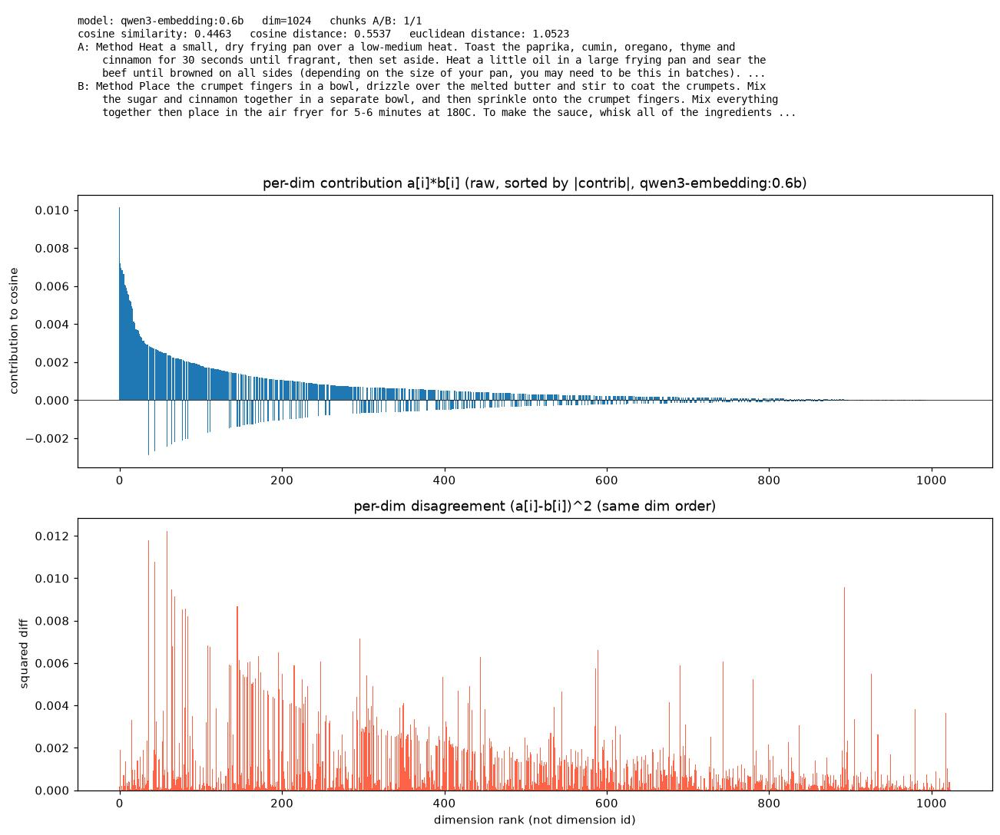
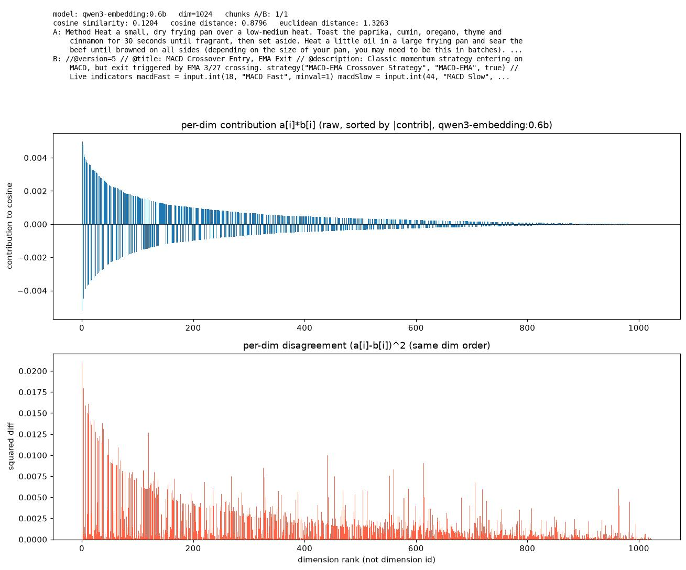

# TactiX — Pine Scripts & Semantic Lineage Rewards

This repo holds the Pine Script indicators and strategies that power the
charting / backtesting engine in the [TactiX Trading Panel](https://app.tactix-panel.xyz/indicator-map) —
plus the experimental toolkit that gives every script a **semantic
fingerprint**, so remixed code can share its rewards with the original it
was built on.


*Every script embedded as a vector, projected into 2D by classical MDS —
distance on the map is real embedding distance. Same-family scripts clump
together; links connect detected remixes and related designs. This is the
same pipeline behind the live
[indicator map](https://app.tactix-panel.xyz/indicator-map).*

---

## Why rewards

It's the work, time, passion and enthusiasm of countless builders that do
the actual "chart magic". And it's not just about making charts look good —
indicators are a high-quality data source that feeds the Jev AI decision
engine.

Speaking for myself: if you want to encourage builders to spend time
building passionately, you NEED to incentivize it. I wouldn't have spent
months building TactiX without a reward system like Hyperliquid's builder
codes.

This is what web3 should be about: code first, applied to real-world
problems, and rewarded for it — not centralized entities funneling out the
majority of rewards.

Most of you probably haven't been in the space from the very beginning, but
the cypherpunk ethos was always about this: define transparent rules, make
code stick to those rules, and abandon centralized points of failure. If
you don't get this, you missed the whole idea of blockchain tech. It's not
about $$$ (that's what the grifters who came later made of it) — it's about
data sovereignty and accountability.

## Crypto World's Fair Colosseum Hackathon

As our contribution to the Crypto World's Fair Hackathon 2026, we're
designing the indicator & strategy rewards system as an open-sourced part
of TactiX. It's the first time we've attempted something like this — an
interesting journey.

Keep track of the progress at
[colosseum.com/arena/projects/tactix-trading-panel](https://colosseum.com/arena/projects/tactix-trading-panel).

See the live indicator map at [app.tactix-panel.xyz/indicator-map](https://app.tactix-panel.xyz/indicator-map).

---

*Deep-dive with all experiment data: [SEMANTIC_SIMILARITY.md](SEMANTIC_SIMILARITY.md) ·
Raw model-comparison notes: [Model comparison.txt](Model%20comparison.txt)*


## The problem

There is already a big community — including commercial creators — building
indicators. Today their work ships as:

- **open source** (code visible, copiable, no revenue),
- **public-closed** (usable by TradingView Pro subscribers, execution runs
  server-side on TradingView, no source),
- **private** (pay-per-indicator, also server-side, no source).

TactiX executes Pine in a **client-side web worker**, so every indicator is
plain readable code — which is great for users, but makes it trivially easy
for copycats to re-upload someone else's work and collect the rewards.

## The invention: semantic lineage

Instead of comparing *code*, we compare *meaning*. On upload, the script is
embedded by a local LLM into a semantic vector that is inscribed into the
indicator database contract alongside the code. Two scripts that *do the
same thing* land close together in vector space even if their code looks
completely different — so a remix can't hide behind a rewrite.

```
.pine source
   │  strip // comments + blank lines      (identity ≠ design — and un-spoofable)
   │  split into overlapping 4000-char chunks
   │  ollama.embed per chunk → mean-pool → L2-normalize
   │  subtract the frozen corpus mean      (removes the "it's Pine code" direction)
   ▼
centered unit vector  →  cosine vs every inscribed vector  →  reward split
```

On inscription the nearest vectors are compared and the split is fixed in
the contract:

| proximity to closest inscribed script | verdict            | reward flow                                 |
| ------------------------------------- | ------------------ | ------------------------------------------- |
| 1.000 – 0.950                         | remix / derivative | majority (>50%) to the parent, curve-scaled |
| 0.950 – 0.900                         | partially derived  | minority (<50%) to the parent               |
| < 0.900                               | original           | 100% to the author                          |

A similarity query can be run **before** inscribing, so an author can see
the verdict, adjust the code, or accept the algorithm's decision — after
inscription the split is set in stone.

**Split cascade.** When remixes chain, rewards flow backwards through the
lineage. A trader using Remix-2:

```
Remix-2 author        75%
Remix-1               25%  →  Remix-1 author   55%  (= 13.75% of total)
                              original parent  45%  (= 11.25% of total)
```

**Anti-frontrunning.** The dApp adds an ECDSA signature to the inscription
call — if anyone tries to swap the reward address or inscribe first, the
contract drops the message.

**Known cost:** every inscription gets more expensive as the vector DB
grows (comparing a new upload against ~5000 stored vectors is an open
scaling question — see `SEMANTIC_SIMILARITY.md` §7–8).

---

## What the fingerprinting actually sees

### Centering is the whole trick

Raw cosine is nearly useless on its own: all Pine embeddings share a large
common direction ("this is Pine code"), so even unrelated scripts score
~0.6. Subtracting the frozen corpus mean removes that shared direction and
leaves only what distinguishes a script.

| raw cosine                                              | centered cosine                                                   |
| ------------------------------------------------------- | ----------------------------------------------------------------- |
|  |  |

Left: everything looks similar. Right: family blocks along the diagonal
remixes, strategy copies, same-design clusters — pop out. Scripts are
greedily chain-ordered so families clump. All thresholds below are
**centered** cosine.

### The corpus map



*PCA projection of all 26 scripts, labelled, family-clustered, with remix
(red) and related (gray) links. `Images/` holds the same heatmap / PCA /
MDS triple for every model we benchmarked (`qwen3-embedding:0.6b`, `:4b`,
`mxbai-embed-large`, `nomic-embed-text`, `embeddinggemma`) in raw and
centered variants, plus interactive 3D versions as
`corpus_mds3d_*.html` in the repo root.*

### Calibrated thresholds (qwen3-embedding:0.6b, 26-script corpus, Oct 2026)

| centered cosine | meaning                                               |
| --------------- | ----------------------------------------------------- |
| ≥ 0.80          | **REMIX** — likely derivative → reward split          |
| ≥ 0.50          | **related** — same design family → reported, no split |
| < 0.50          | distinct                                              |

Anchors: an indicator vs its own strategy copy scores 0.82–0.86; unrelated
pairs median ~-0.06, p95 ~0.38.

---

## Experiments — how we stress-tested it

Every figure below is reproducible — commands at the end. Full data and
discussion: **[SEMANTIC_SIMILARITY.md](SEMANTIC_SIMILARITY.md)**.

### Merge sweep — can a remixer evade detection by bolting on code?

Two scripts spliced together at 0→100% foreign content
(`08_rsi_divergence.pine` × `macd_ema.pine`), embedded at every step:

| appended as a block (`concat`)                                         | woven in line-by-line (`interleave`)                                           |
| ---------------------------------------------------------------------- | ------------------------------------------------------------------------------ |
|  |  |

- **concat**: just ~5% appended foreign code already pulls the pooled vector
  under the remix bar — the block forms its own chunks and mean-pooling
  weighs chunks equally. *Block-appends evade the flag.*
- **interleave**: stays "REMIX of A" up to ~50–55% foreign lines — every
  chunk still looks mostly like A. *Line-by-line laundering gets caught.*
- **dead zone**: ~55–80% merges score ~0.5 vs *both* parents —
  undetectable by whole-vector cosine alone.
- Backstop: chunk-level max-similarity (the heatmap in
  `compare_two_scripts.ipynb`) still exposes the copied half of a block
  merge — whole-vector scoring flags, chunk-level confirms.

### Word-mutation drift — how much does vocabulary matter?

Tokens of script A replaced one-by-one with tokens drawn from B; each
mutant is re-embedded:



*Top: cosine vs A and vs B as tokens are swapped. Bottom: per-dimension
contribution heatmap — you watch A's dominant embedding dims erode.*



*The mutant's path through semantic space (2D PCA, coloured by % replaced).*

**The skeleton persists.** With *every* token replaced, the code mutant
still scores ~0.6 vs A — structure (ordering, syntax rhythm, line shapes)
is a huge part of a script's embedding. Plagiarism that keeps the skeleton
is easier to catch than plagiarism that restructures.

The same experiment on prose (a birria recipe drifting toward a churros
recipe, `Images/word_sweep_fourier.jpg`) shows the crossover ~10% earlier —
code corpora share vocabulary (`ta.*`, `input.*`, `plot`), which compresses
the range.

### Sanity checks — arbitrary text

`compare_texts_app.py` embeds any two texts and saves an overview card to
`comparisons/`:

| identical (cos 1.000)                                                           | close (cos 0.446)                                                                  | distant (cos 0.120)                                                                    |
| ------------------------------------------------------------------------------- | ---------------------------------------------------------------------------------- | -------------------------------------------------------------------------------------- |
|  |  |  |

Calibration probes: identical recipe 0.9998 · beef→lamb recipe remix 0.85 ·
birria vs churros 0.44 · birria vs a Pine script 0.12. The model orders
these sensibly — but raw cosine never gets very low, which is why centering
matters.

---

## Reproduce every figure

```bash
# setup — Python deps + a local Ollama
python3 -m venv .venv && .venv/bin/pip install -r requirements.txt
ollama serve
ollama pull qwen3-embedding:0.6b        # calibrated model
# ollama pull mxbai-embed-large         # the model behind the live indicator-map

# build the vector DB + pairwise report
.venv/bin/python embed_indicators.py build
.venv/bin/python embed_indicators.py report
.venv/bin/python embed_indicators.py check indicator-scripts/macd_ema.pine

# corpus figures -> corpus_heatmap / corpus_map / corpus_mds + 3D html, per model DB
.venv/bin/python corpus_map.py

# the sweeps
.venv/bin/python merge_experiment.py                 # concat
.venv/bin/python merge_experiment.py --interleave
.venv/bin/python word_sweep_fourier.py --pine \
    indicator-scripts/08_rsi_divergence.pine indicator-scripts/macd_ema.pine

# interactive pair explorer -> http://localhost:8000, cards saved to comparisons/
.venv/bin/python compare_texts_app.py
```

Tooling map:

| file                                           | what it does                                                                                                                                                                |
| ---------------------------------------------- | --------------------------------------------------------------------------------------------------------------------------------------------------------------------------- |
| `embed_indicators.py`                          | CLI: `build` embeds all `.pine` in `indicator-scripts/` into a per-model JSON DB; `report` prints the pairwise matrix; `check <file>` simulates an upload and finds parents |
| `embed_files.ipynb`                            | interactive companion to `build` — pick which files to (re)embed per model                                                                                                  |
| `compare_two_scripts.ipynb`                    | one pair in depth: verdict vs thresholds, neighbours, chunk-level heatmap, contribution bars                                                                                |
| `compare_texts.ipynb` / `compare_texts_app.py` | embed any two texts (not just Pine); the `.py` is a browser UI with templates                                                                                               |
| `merge_experiment.py`                          | merge-sweep: splices two scripts 0–100%, plots similarity vs each parent                                                                                                    |
| `word_sweep_fourier.py`                        | token-by-token mutation drift A→B; contribution erosion heatmap + 2D trajectory map                                                                                         |
| `corpus_map.py`                                | all-vs-all: clustered similarity heatmap + labelled PCA/MDS maps + interactive 3D html                                                                                      |

Notes:

- Scores are **per-model** — each model gets its own DB and frozen
  reference mean. Never compare 0.6b numbers to 4b numbers.
- Both qwen3 sizes run on consumer hardware, so an indicator author can
  verify their verdict locally (`4b` is ~5–6× slower; we default to `0.6b`).
- Thresholds are only valid against the *frozen* mean — refreezing on a
  different corpus shifts every score.

---

## Adding your own indicator or strategy

We want indicator and strategy authors to earn rewards when traders use
their work. If you publish a script here, you can attach a payout address
so a share of usage / subscription fees flows back to you.

**How to opt in:**

1. Add a metadata header at the top of your `.pine` file:

   ```pine
   // @title: My Awesome Indicator
   // @author: YourName
   // @reward_address: 0xABCDEF1234....
   // @reward_bps: 500   // optional, e.g. 5% of attributable fees
   ```

2. Open a PR adding your script. Include a short description of what it
   does and a screenshot of it running on a chart.

3. Rewards are distributed periodically based on usage metrics (times
   loaded, backtests run, and live-chart time) tracked by the app.

**Guidelines:**

- Only submit scripts you wrote or have rights to redistribute. Respect the
  original license (many TradingView scripts are MPL-2.0 — keep the license
  header intact and credit the original author).
- Scripts that are broken, plagiarized without attribution, or malicious
  (e.g. repaint scams presented as signals) will be removed and forfeit
  rewards.

Questions, or want to propose a different reward split? Open an issue or
reach out to the maintainers.

